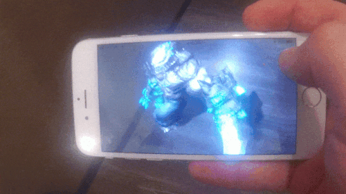

# ARKitXamarinDemo
[ARKit](https://developer.apple.com/arkit/) + UrhoSharp + Xamarin

## Prerequisites
 * iPhone 6S or later (iPhone 5SE works, iPhone 6 does not)
 * iOS 11 release
 * Xcode 9 GM
 * [Xamarin.iOS 11.0](https://jenkins.mono-project.com/view/Xamarin.MaciOS/job/xamarin-macios-builds-xcode9/) or later
 * In **Visual Studio for Mac** change "Apple SDK" path to Xcode 9 GM in the preferences

## Video (click to play):

