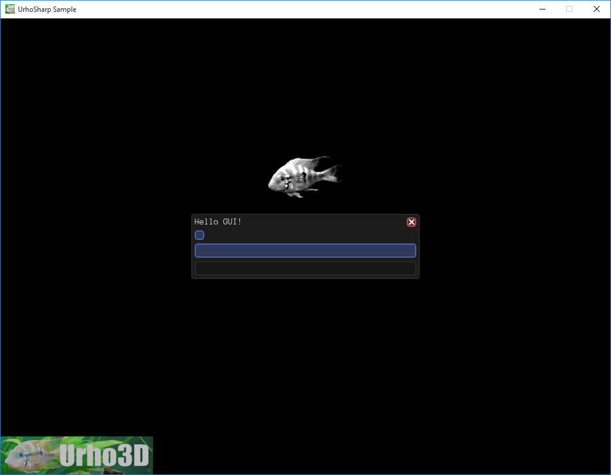

 A simple 'HelloWorld' GUI created purely from code.
=============

This sample demonstrates:
- Creation of controls and building a UI hierarchy
- Loading UI style from XML and applying it to controls
- Handling of global and per-control events
For more advanced users (beginners can skip this section):
- Dragging UIElements
- Displaying tooltips

