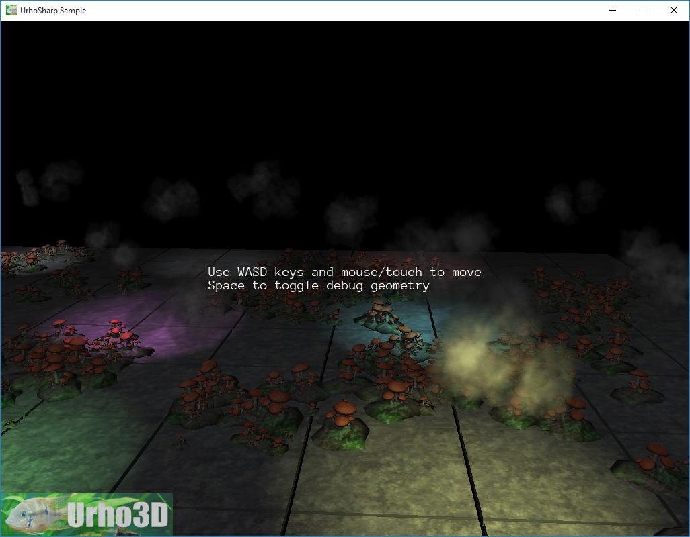

 Billboard example.
=============

This sample demonstrates:
- Populating a 3D scene with billboard sets and several shadow casting spotlights
- Parenting scene nodes to allow more intuitive creation of groups of objects
- Examining rendering performance with a somewhat large object and light count

