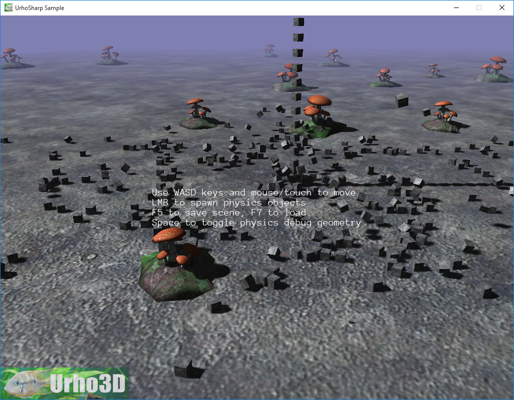

 Physics stress test example.
=============

This sample demonstrates:
- Physics and rendering performance with a high (1000) moving object count
- Using triangle meshes for collision
- Optimizing physics simulation by leaving out collision event signaling

