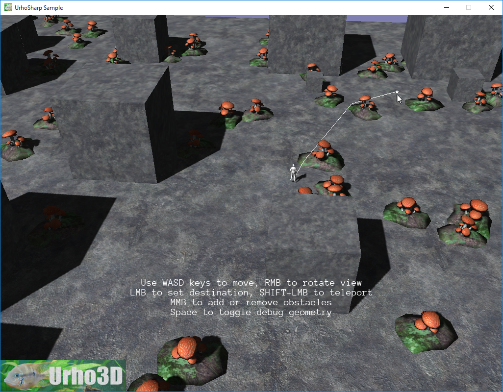

 Navigation example.
=============

This sample demonstrates:
- Generating a navigation mesh into the scene
- Performing path queries to the navigation mesh
- Rebuilding the navigation mesh partially when adding or removing objects
- Visualizing custom debug geometry
- Raycasting drawable components
- Making a node follow the Detour path

