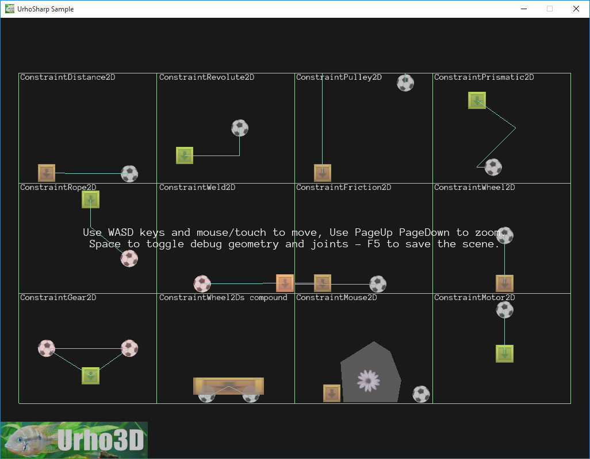

 Urho2D constraints sample.
=============

This sample is designed to help understanding and chosing the right constraint.
This sample demonstrates:
- Creating physics constraints
- Creating Edge and Polygon Shapes from vertices
- Displaying physics debug geometry and constraints' joints
- Using SetOrderInLayer to alter the way sprites are drawn in relation to each other
- Using Text3D to display some text affected by zoom
- Setting the background color for the scene

