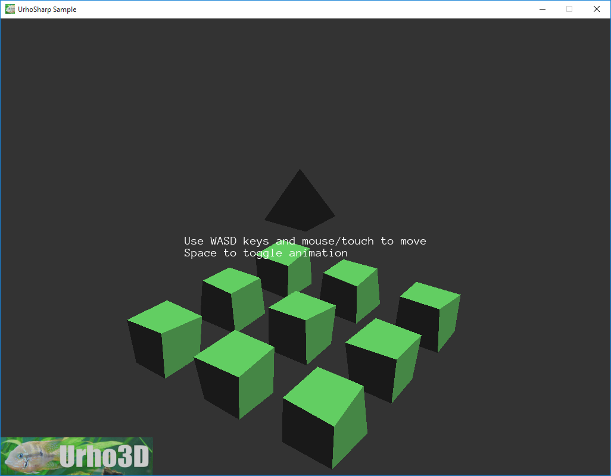

Dynamic geometry example.
=========================

This sample demonstrates:
- Cloning a Model resource
- Modifying the vertex buffer data of the cloned models at runtime to efficiently animate them
- Creating a Model resource and its buffer data from scratch

