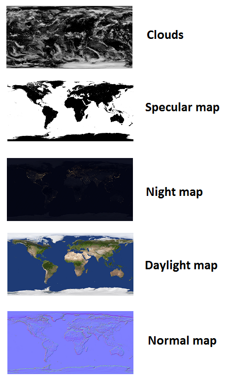

This sample showcases how to write and use custom shaders. It's basically the same HelloWorld sample, but
it applies a more complicated material to the Earth.

The material is defined in [Earth.xml](https://github.com/xamarin/urho-samples/blob/master/HoloLens/02_HelloWorldAdvanced/Data/Materials/Earth.xml). It defines 5 textures and some parameters:

 

Also, it defines [EarthTechnique.xml](https://github.com/xamarin/urho-samples/blob/master/HoloLens/02_HelloWorldAdvanced/Data/Techniques/EarthTechnique.xml) technique which in this case just defines a single 
pass for a custom shader - [CustomLitSolid.hlsl](https://github.com/xamarin/urho-samples/blob/master/HoloLens/02_HelloWorldAdvanced/Data/Shaders/HLSL/CustomLitSolid.hlsl).
The Pixel Shader part of that shader merges all those 5 textures:

 

